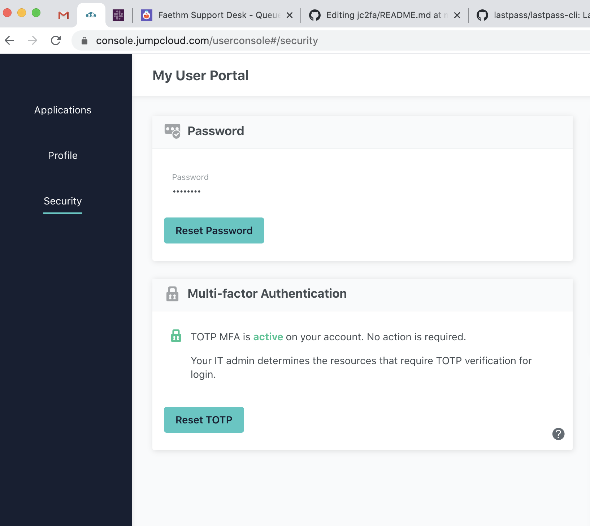

# Command line 2fa

# Requirements

* https://github.com/lastpass/lastpass-cli (`brew install lastpass-cli` on mac)
* https://www.nongnu.org/oath-toolkit/ (`brew install oath-toolkit` on mac)

# Setup

* store the key for your jumpcloud 2fa in lastpass (I use the string `jctotp` for mine, but whatever works). 
* create the config file `~/.jccfg`

```
 echo user=mylastpassuser >> ~/.jccfg
 echo record=jctotp >> ~/.jccfg # replace "jctotp" with the name you use for the record
```

* place jc2fa, getpwd and config scripts in `~/bin` and make sure the directory is in your path
* You can generate a new string if needed in the jumpcloud console (Security -> "Reset TOTP")



# Note:
You will need to use your lastpass password to retrieve the key for the jc2fa script. The session will last for a while,but I generally have to enter my password several times in a day's work. 


